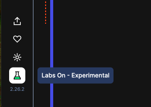

# Prepare your environment

## Prerequisites
- Java JDK 17
- Maven is not required, you can use the wrapper in this repository to compile and run the code.

## Install temporal cli

The only thing you need to follow this workshop is have `Temporal cli` installed in your computer.
Follow the instructions [here](https://docs.temporal.io/cli#install) to install it. 


Once you have Temporal CLI installed you can use the script [start-temporal-cli.sh](./start-temporal-cli.sh) to start the 
server.


After starting the Server, enable "Experimental mode" in the UI.




## Alternatively you can use [docker-compose](https://github.com/temporalio/docker-compose) 

```bash
git clone https://github.com/temporalio/docker-compose.git
cd  docker-compose
```

- Open `dynamicconfig/development-sql.yaml`and add 
```
frontend.enableUpdateWorkflowExecution:
  - value: true

```

- Start the server

```bash
cd  docker-compose
docker-compose up
```

- To clean the environment/server run

```bash
cd  docker-compose
docker-compose down -v
```
#### Only for the `_final` exercise

- Login into the container `temporal-admin-tools`

`docker exec -it temporal-admin-tools bash`

- And add the `TransferRequestStatus` Search Attribute

`temporal operator search-attribute create --namespace "default" \
--name TransferRequestStatus --type Keyword`

