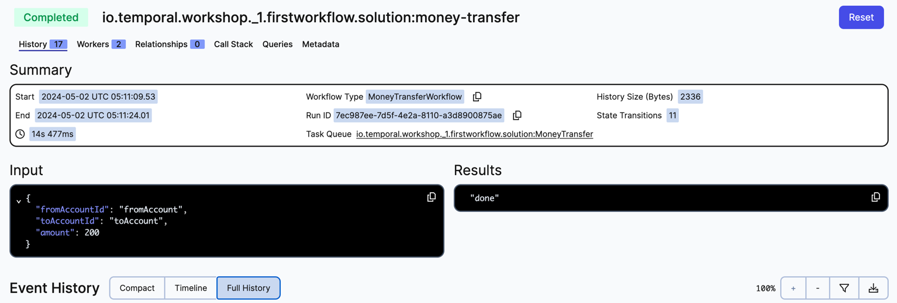

# My first workflow

This exercise will guide you, step by step, on how to:
- implement a workflow
- implement activities
- register workflow and activity implementation in the worker
- start and run a workflow execution


## Exercise: Implement your first Temporal Workflows

This folder contains two sub-folders: 
- `initial` is you starting point, the code skeleton within which you must work to complete the exercise following the steps described below..
- `solution` contains the final code, after all steps are implemented.


Begin by working with the code in the `initial` folder. Take your time to familiarize yourself with the following pieces of code: 
- [./initial/MoneyTransferWorkflow.java](./initial/MoneyTransferWorkflow.java): Workflow interface
- [./initial/AccountService.java](./initial/AccountService.java): Activity interface
- [./initial/AccountServiceImpl.java](./initial/AccountServiceImpl.java): Activity implementation
- [./initial/Starter.java](./initial/Starter.java): Client that sends the request to the server to initiate the workflow.
- [./initial/WorkerProcess.java](./initial/WorkerProcess.java): This is our application, this process executes our code.


####  Workflow implementation

[What is a Temporal Workflow?](https://docs.temporal.io/workflows)

Create a class called `MoneyTransferWorkflowImpl.java` that implements `MoneyTransferWorkflow.java`. 

Our implementation is very simple for now, it prints a log and returns a String.


```
package io.temporal.workshop._1.firstworkflow.initial;

import io.temporal.workflow.Workflow;
import io.temporal.workshop.model.TransferRequest;
import org.slf4j.Logger;


public class MoneyTransferWorkflowImpl implements MoneyTransferWorkflow {

    private final Logger log = Workflow.getLogger(MoneyTransferWorkflowImpl.class.getSimpleName());

    @Override
    public String transfer(TransferRequest transferRequest) {
        log.info("Init transfer: " + transferRequest);
        
        log.info("End transfer: " + transferRequest);

        return "done";
    }
}

```

####  Register the Workflow implementation in the worker


Go to the file [./initial/WorkerProcess.java](./initial/WorkerProcess.java) and comment out the following lines.

```
//Worker worker = factory.newWorker(TASK_QUEUE, WorkerOptions.newBuilder().build());

...

//worker.registerWorkflowImplementationTypes(MoneyTransferWorkflowImpl.class);
```

These lines
- create a worker, using the client connection created above in the code, 
- and register the workflow implementation on it.

> Note that `Starter` and `WorkerProcess` use the same TASK_QUEUE name, otherwise the worker won't be able to "see" the 
request sent by the client.


####  Run the code

- Ensure you have everything you need to run the code, and the Temporal Server is running.
See [prepare-your-environment.md](./../../../../../../../../prepare-your-environment.md).

- Stop any processes that are running as part of other exercises (such as workers), except the Temporal Server.

- Execute the file Starter [./initial/Starter.java](./initial/Starter.java), that sends a request to the server to start the workflow.

```bash
# Go to the root directory
cd ./../../../../../../../../
# from the root directory execute
 ./mvnw compile exec:java -Dexec.mainClass="io.temporal.workshop._1.firstworkflow.initial.Starter"

```
If we go to [http://localhost:8080/](http://localhost:8080/) we will see the workflow in `Running` state, but nothing else
will happen until we start our application (the worker).

- Start the worker

```bash
# Go to the root directory
cd ./../../../../../../../../
# from the root directory execute
 ./mvnw compile exec:java -Dexec.mainClass="io.temporal.workshop._1.firstworkflow.initial.WorkerProcess"

```

You will see from the worker logs, that it:
- polls for "Workflow" tasks from the taskqueue with name `io.temporal.workshop._1.firstworkflow.initial:MoneyTransfer`
```
start: Poller{name=Workflow Poller taskQueue="io.temporal.workshop._1.firstworkflow.initial:MoneyTransfer", namespace="default", identity=13522@local} 
```
- runs our workflow code
```
15:42:21.444 {io.temporal.workshop._1.firstworkflow.initial:money-transfer} INFO  MoneyTransferWorkflowImpl - Init transfer: TransferRequest[fromAccountId=fromAccount, toAccountId=toAccount, amount=200.0] 
15:42:21.444 {io.temporal.workshop._1.firstworkflow.initial:money-transfer} INFO  MoneyTransferWorkflowImpl - End transfer: TransferRequest[fromAccountId=fromAccount, toAccountId=toAccount, amount=200.0] 
```

Navigate to  [http://localhost:8080/](http://localhost:8080/), our workflow have changed the state to `Completed`


#### Modify the workflow to add activities

[What is a Temporal Activity?](https://docs.temporal.io/activities)

Let's add activity invocations to the workflow implementation (`MoneyTransferWorkflowImpl.java`) we have created above.

- Open the file `MoneyTransferWorkflowImpl.java` and create an activity stub. 

```
    private final AccountService accountService =
            Workflow.newActivityStub(
                    AccountService.class,
                    ActivityOptions.newBuilder()
                            .setStartToCloseTimeout(Duration.ofSeconds(3))
//                            .setRetryOptions(
//                                    RetryOptions.newBuilder()
//                                            .setMaximumAttempts(5)
//                                            .build())
                            .build());
```


This is a proxy that allows us to invoke activities from workflow code and define other options like max number of retires, timeouts etc... 


- Modify the main workflow method to invoke `withdraw` and `deposit` method. Replace the method implementation 
with the following code.

```
    @Override
    public String transfer(TransferRequest transferRequest) {
        log.info("Init transfer: " + transferRequest);

        accountService.withdraw(
                new WithdrawRequest(
                        transferRequest.fromAccountId(),
                        transferRequest.amount()));

        // Exception
        accountService.deposit(
                new DepositRequest(
                        transferRequest.toAccountId(),
                        transferRequest.amount()));

        log.info("End transfer: " + transferRequest);

        return "done";
    }
```


####  Register the Activity implementation in the Worker


Go to the file [./initial/WorkerProcess.java](./initial/WorkerProcess.java) and comment out the following line.

```
//worker.registerActivitiesImplementations(new AccountServiceImpl(new BankingClient()));
```


####  Run the code

- Ensure you have everything you need to run the code, and the Temporal Server is running.
  See [prepare-your-environment.md](./../../../../../../../../prepare-your-environment.md).

- Stop any processes that are running as part of other exercises (such as workers), except the Temporal Server.


- Schedule the workflow [./initial/Starter.java](./initial/Starter.java).

```bash
# Go to the root directory
cd ./../../../../../../../../
# from the root directory execute
 ./mvnw compile exec:java -Dexec.mainClass="io.temporal.workshop._1.firstworkflow.initial.Starter"

```

- Start the worker

```bash
# Go to the root directory
cd ./../../../../../../../../
# from the root directory execute
 ./mvnw compile exec:java -Dexec.mainClass="io.temporal.workshop._1.firstworkflow.initial.WorkerProcess"

```

You will see from the worker logs, that it:
- polls for "Workflow" tasks from the taskqueue with name `io.temporal.workshop._1.firstworkflow.initial:MoneyTransfer`
```
start: Poller{name=Workflow Poller taskQueue="io.temporal.workshop._1.firstworkflow.initial:MoneyTransfer", namespace="default", identity=13522@local} 
```
- polls for "Activity" tasks from the taskqueue with name `io.temporal.workshop._1.firstworkflow.initial:MoneyTransfer`
```
start: Poller{name=name=Activity Poller taskQueue="io.temporal.workshop._1.firstworkflow.initial:MoneyTransfer", namespace="default", identity=13522@local} 
```

> We could have Workflows and Activities in different taskqueue names, for the sake of simplicity 
in this workshop we will use the same taskqueue name.


- runs our workflow code with the new implementation, invoking the activity methods
```
17:08:51.715 {io.temporal.workshop._1.firstworkflow.initial:money-transfer} INFO  MoneyTransferWorkflowImpl - Init transfer: TransferRequest[fromAccountId=fromAccount, toAccountId=toAccount, amount=200.0] 
17:08:51.751 {io.temporal.workshop._1.firstworkflow.initial:money-transfer} INFO  AccountServiceImpl - Init withdraw : WithdrawRequest[accountId=fromAccount, amount=200.0] 
Withdraw init: WithdrawRequest[accountId=fromAccount, amount=200.0]
Withdraw end: WithdrawRequest[accountId=fromAccount, amount=200.0]
17:08:52.075 {io.temporal.workshop._1.firstworkflow.initial:money-transfer} INFO  AccountServiceImpl - End withdraw : WithdrawRequest[accountId=fromAccount, amount=200.0] 
17:08:52.113 {io.temporal.workshop._1.firstworkflow.initial:money-transfer} INFO  AccountServiceImpl - Init deposit : DepositRequest[accountId=toAccount, amount=200.0] 
Deposit init: DepositRequest[accountId=toAccount, amount=200.0]
Deposit end: DepositRequest[accountId=toAccount, amount=200.0]
17:08:52.841 {io.temporal.workshop._1.firstworkflow.initial:money-transfer} INFO  AccountServiceImpl - End deposit : DepositRequest[accountId=toAccount, amount=200.0] 
17:08:52.856 {io.temporal.workshop._1.firstworkflow.initial:money-transfer} INFO  MoneyTransferWorkflowImpl - End transfer: TransferRequest[fromAccountId=fromAccount, toAccountId=toAccount, amount=200.0] 
```


- Navigate to  [http://localhost:8080/](http://localhost:8080/), open the workflow execution and familiarize yourself 
with the information provided by the UI by clicking through the different tabs (Compact, Timeline and Full history)


