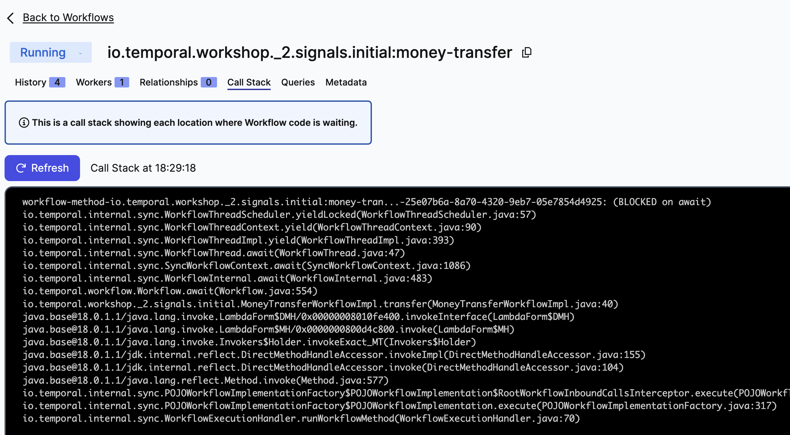
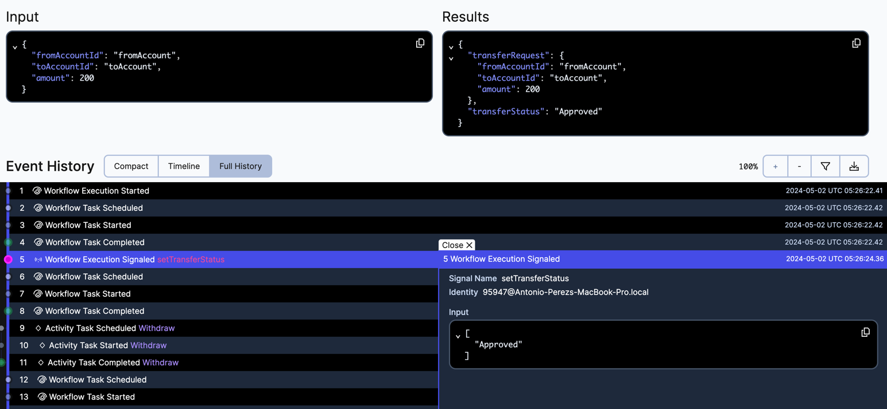

# Signal Workflow

[What is a Signal?](https://docs.temporal.io/workflows#signal) 


## Exercise: Modify the workflow implementation to block/wait for approval if the amount to transfer is greater than 100

Modify the money transfer workflow so that it blocks and waits to receive an input if the amount to transfer is greater than 100.

Use [Signal](https://docs.temporal.io/workflows#signal) and `Workflow.await` to implement this feature.

This folder contains two sub-folders:
- `initial` is you starting point, the code skeleton within which you must work to complete the exercise following the steps described below..
- `solution` contains the final code, after all steps are implemented.


Begin by working with the code in the `initial` folder. Take your time to familiarize yourself with the following pieces of code:
- [./initial/MoneyTransferWorkflow.java](./initial/MoneyTransferWorkflow.java): Workflow interface.
- [./initial/MoneyTransferWorkflowImpl.java](./initial/MoneyTransferWorkflowImpl.java): Workflow implementation.
- [./initial/Starter.java](./initial/Starter.java): Client that sends the request to the server to initiate the workflow.
- [./initial/WorkerProcess.java](./initial/WorkerProcess.java): This is our application, this process executes our code.
- [./initial/Signal.java](./initial/Signal.java): Client that send a signal to a running workflow.


###  Implementation

- Change the workflow main method to wait for an input if amount > 100

Open [./initial/MoneyTransferWorkflowImpl.java](./initial/MoneyTransferWorkflowImpl.java) and implement add the following code before `accountService.withdraw`.

```
      if (transferRequest.amount() >= 100) {
          transferStatus = TransferStatus.ApprovalRequired;
          Workflow.await(() -> this.transferStatus != TransferStatus.ApprovalRequired);
      }

      if (TransferStatus.Approved != this.transferStatus) {
          log.info("Completed for request: " + transferRequest);
          final TransferResponse transferResponse = new TransferResponse(transferRequest, transferStatus);
          log.info("TransferResponse: " + transferResponse);
          return transferResponse;
      }
```


> `Workflow.await` blocks the current Workflow Execution until the provided unblock condition is evaluated to true.
The method can accept a timer to unblock after the provided duration. E.g.:
> - `Workflow.await(java.time.Duration.ofDays(5), () -> this.transferStatus != TransferStatus.ApprovalRequired);`
> - `Workflow.await(java.time.Duration.ofSeconds(30), () -> this.transferStatus != TransferStatus.ApprovalRequired);`


- Declare the @SignalMethod in the workflow interface.

Open [./initial/MoneyTransferWorkflow.java](./initial/MoneyTransferWorkflow.java) and uncomment the following code:

```
    @SignalMethod
    void setTransferStatus(TransferStatus transferStatus);
```


- Implement the new method:

Open [./initial/MoneyTransferWorkflowImpl.java](./initial/MoneyTransferWorkflowImpl.java) and implement the new method. Set the input value to `this.transferStatus`.

```
    @Override
    public void setTransferStatus(final TransferStatus transferStatus) {
        this.transferStatus = transferStatus;
    }
```


- Change the client to Signal the workflow.

Open [./initial/Signal.java](./initial/Signal.java) and uncomment the following line.

```
workflow.setTransferStatus(TransferStatus.Approved);
```

###  Run the code

- Ensure you have everything you need to run the code, and the Temporal Server is running.
  See [prepare-your-environment.md](./../../../../../../../../prepare-your-environment.md).

- Stop any processes that are running as part of other exercises (such as workers), except the Temporal Server.

- Execute the file Starter [./initial/Starter.java](./initial/Starter.java), to start the workflow.

```bash
# Go to the root directory
cd ./../../../../../../../../
# from the root directory execute
 ./mvnw compile exec:java -Dexec.mainClass="io.temporal.workshop._2.signal.initial.Starter"

```

> Note that the amount > 100

- Start the worker

```bash
# Go to the root directory
cd ./../../../../../../../../
# from the root directory execute
 ./mvnw compile exec:java -Dexec.mainClass="io.temporal.workshop._2.signal.initial.WorkerProcess"

```

Navigate to  [http://localhost:8080/](http://localhost:8080/), open the workflow execution and click on `Call Stack`.
From the information in this tab we can infer why our execution is not making progress, is `BLOCKED on await`




- Send a Signal to `Approve` or `Deny` the operation.

```bash
# Go to the root directory
cd ./../../../../../../../../
# from the root directory execute
 ./mvnw compile exec:java -Dexec.mainClass="io.temporal.workshop._2.signal.initial.Signal"

```

After sending the Signal the execution unblocks and completes.

- Navigate to  [http://localhost:8080/](http://localhost:8080/), open the workflow execution.
Note that the signal event has been recorded in the event history along with the payload sent.

