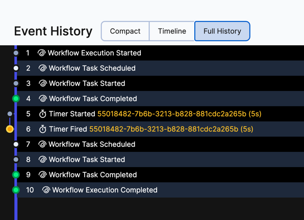

# Query Workflow

- [What is a Query?](https://docs.temporal.io/workflows#query)

## Exercise: Modify the workflow implementation to retrieve the internal state

A Query is a synchronous operation that is used to get the state of a Workflow Execution.

Modify the workflow to add a query method that returns the value of `this.transfeStatus`.

Use [Query](https://docs.temporal.io/workflows#query) and `Workflow.await` with duration to implement this feature.

This folder contains two sub-folders:
- `initial` is you starting point, the code skeleton within which you must work to complete the exercise following the steps described below..
- `solution` contains the final code, after all steps are implemented.


Begin by working with the code in the `initial` folder. Take your time to familiarize yourself with the following pieces of code:
- [./initial/MoneyTransferWorkflow.java](initial/MoneyTransferWorkflow.java): Workflow interface.
- [./initial/MoneyTransferWorkflowImpl.java](initial/MoneyTransferWorkflowImpl.java): Workflow implementation.
- [./initial/StarterAndQuery.java](initial/StarterAndQuery.java): Client that sends the request to the server and 
query the workflow two times to show how the internal state/variable changes.
- [./initial/WorkerProcess.java](initial/WorkerProcess.java): This is our application, this process executes our code.


####  Implementation


- Change the workflow main method to wait for an input if amount > 100.
  If the input is not received after 5 seconds the operation is marked as TimedOut.

Open [./initial/MoneyTransferWorkflowImpl.java](initial/MoneyTransferWorkflowImpl.java) and paste the following code after `transferStatus = TransferStatus.Approved;`.

```
      if (transferRequest.amount() >= 100) {
          transferStatus = TransferStatus.ApprovalRequired;

          final Duration timeout = Duration.ofSeconds(5); // Can be days, years...
          boolean transferStatusUpdatedWithinTimeOut =
                  Workflow.await(timeout, () ->
                          transferStatus != TransferStatus.ApprovalRequired);

          if (!transferStatusUpdatedWithinTimeOut) {
              transferStatus = TransferStatus.TimedOut;
              log.info("Status not updated within " + timeout+ " seconds");
              return new TransferResponse(transferRequest, transferStatus);
          }
      }
```


> `Workflow.await` blocks the current Workflow Execution until the provided unblock condition is evaluated to true.
The method accepts a timer, and it returns false if the timer fires


- Declare the @QueryMethod in the workflow interface:

Open [./initial/MoneyTransferWorkflow.java](initial/MoneyTransferWorkflow.java) and comment out the following code:

```
    @QueryMethod
    TransferStatus getStatus();
```


- Implement the new method:

Open [./initial/MoneyTransferWorkflowImpl.java](initial/MoneyTransferWorkflowImpl.java) and implement the new method returning `this.transferStatus`.

```
    @Override
    public TransferStatus getStatus() {
        return this.transferStatus;
    }

```

- Implement the client to query the workflow two times, after the workflow start and 6 seconds later.

Open [./initial/StarterAndQuery.java](initial/StarterAndQuery.java) and comment out the following lines.

```
      TransferStatus transferStatusAfterStart = getTransferStatus(client).getStatus();
      System.out.println("TransferStatusAfterStart: " + transferStatusAfterStart);
      Thread.sleep(6000);
      TransferStatus transferStatusAfter6Seconds = getTransferStatus(client).getStatus();
      System.out.println("TransferStatusAfter6Seconds: " + transferStatusAfter6Seconds);
```

####  Run the code

- Ensure you have everything you need to run the code, and the Temporal Server is running.
  See [prepare-your-environment.md](./../../../../../../../../prepare-your-environment.md).

- Stop any processes that are running as part of other exercises (such as workers), except the Temporal Server.

- Start the worker

```bash
# Go to the root directory
cd ./../../../../../../../../
# from the root directory execute
 ./mvnw compile exec:java -Dexec.mainClass="io.temporal.workshop._3.query.initial.WorkerProcess"

```

- Execute the file Starter [./initial/StarterAndQuery.java](initial/StarterAndQuery.java), to start and query the workflow.

```bash
# Go to the root directory
cd ./../../../../../../../../
# from the root directory execute
./mvnw compile exec:java -Dexec.mainClass="io.temporal.workshop._3.query.initial.StarterAndQuery"

```

> Note that the amount > 100

`StarterAndQuery` start and query the workflow two times. 
Note that `getStatus` returns a different value each time, since `transferStatus` value changes after 5 seconds.

```
TransferStatusAfterStart: ApprovalRequired
Waiting 6 seconds
TransferStatusAfter6Seconds: TimedOut

```

- Navigate to  [http://localhost:8080/](http://localhost:8080/) and open the workflow execution.
  - Queries are not recorded in the event history (no new events are added).
  - `Workflow.await` creates a timer that fires after 5 seconds.
        
