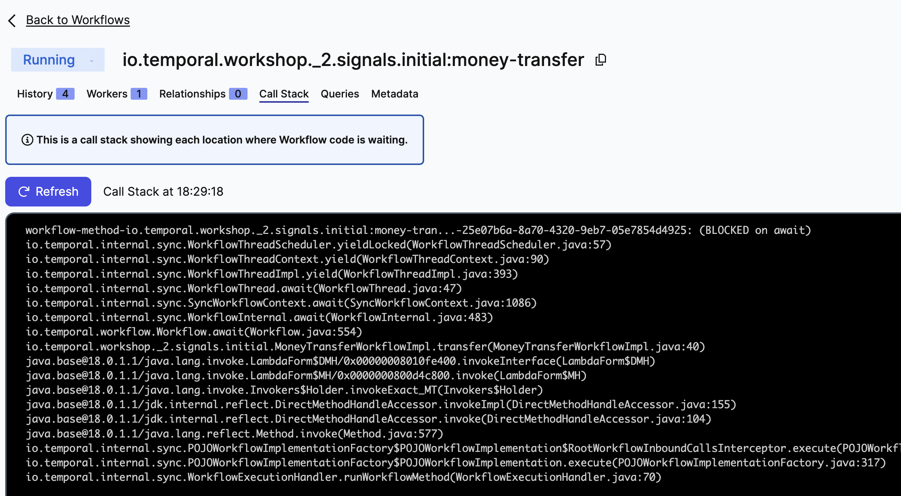

# Temporal Update Workflow

[What is an Update?](https://docs.temporal.io/workflows#update) 

Let's modify the money transfer workflow so that it will wait for an input if the amount to transfer is greater than 100.

This exercise is similar to `_2.signal`, with the difference that we will use UpdateWorkflow to set the operation status.

While Signal is an asynchronous request and can't return anything, Update is synchronous and blocks the call until the method returns.

## Exercise: Add a UpdateMethod to the workflow and block the execution if the amount to transfer is greater than 100

This folder contains two sub-folders:
- `initial` is you starting point, the code skeleton you have to work in to complete the exercise following the
  steps described below.
- `solution` contains the final code, after all steps are implemented.


Start working with the code in the `initial` folder.
Take your time to familiarize yourself with the following pieces of code:
- [./initial/MoneyTransferWorkflow.java](initial/MoneyTransferWorkflow.java): Workflow interface.
- [./initial/MoneyTransferWorkflowImpl.java](initial/MoneyTransferWorkflowImpl.java): Workflow implementation.
- [./initial/Starter.java](initial/Starter.java): Client that sends the request to the server to initiate the workflow.
- [./initial/WorkerProcess.java](initial/WorkerProcess.java): This is our application, this process executes our code.
- [./initial/Update.java](initial/Update.java): Client that send an input to a running workflow and waits until the method returns.


####  Implementation

- Declare an @UpdateMethod in the workflow interface:

Open [./initial/MoneyTransferWorkflow.java](initial/MoneyTransferWorkflow.java) and comment out the following code:

```
    @UpdateMethod
    String setTransferStatus(TransferStatus transferStatus);
```


- Implement the new method:

Open [./initial/MoneyTransferWorkflowImpl.java](initial/MoneyTransferWorkflowImpl.java) and implement the new method. Set the input value to `this.transferStatus`.

```
    @Override
    public String setTransferStatus(final TransferStatus transferStatus) {
        Workflow.sleep(Duration.ofSeconds(5));
        this.transferStatus = transferStatus;
        return "Workflow updated after 5 seconds";
    }

```

> We use [`Workflow.sleep`](https://docs.temporal.io/workflows#timer) to increase the update method latency. It creates 
a persisted timer in the server and the workers don't consume additional resources while waiting for a Timer to fire. 


- Change the workflow main method to wait for an input if amount > 100

Open [./initial/MoneyTransferWorkflowImpl.java](initial/MoneyTransferWorkflowImpl.java) and implement add the following code before `accountService.withdraw`.

```
      if (transferRequest.amount() >= 100) {
          transferStatus = TransferStatus.ApprovalRequired;
          Workflow.await(() -> this.transferStatus != TransferStatus.ApprovalRequired);
      }

      if (TransferStatus.Approved != this.transferStatus) {
          log.info("Completed for request: " + transferRequest);
          final TransferResponse transferResponse = new TransferResponse(transferRequest, transferStatus);
          log.info("TransferResponse: " + transferResponse);
          return transferResponse;
      }
```


> `Workflow.await` blocks the current Workflow Execution until the provided unblock condition is evaluated to true.
The method accepts a timer too, to unblock after the provided duration. E.g.:
> - `Workflow.await(Duration.ofDays(5), () -> this.transferStatus != TransferStatus.ApprovalRequired);`
> - `Workflow.await(Duration.ofSeconds(30), () -> this.transferStatus != TransferStatus.ApprovalRequired);`


- Implement the client to execute the UpdateMethod.

Open [./initial/Update.java](initial/Update.java) and comment out the following line.

```
String updateResult = workflow.setTransferStatus(TransferStatus.Approved);
System.out.println("Update result "+ updateResult);
```

####  Run the code

- Ensure you have everything you need to run the code, and the Temporal Server is running.
  See [prepare-your-environment.md](./../../../../../../../../prepare-your-environment.md).

- Stop any processes that are running as part of other exercises (such as workers), except the Temporal Server.

- Execute the file Starter [./initial/Starter.java](initial/Starter.java), to start the workflow.

```bash
cd ./../../../../../../../../
./mvnw compile exec:java -Dexec.mainClass="io.temporal.workshop._4.update.initial.Starter"

```

> Note that the amount > 100

- Start the worker

```bash
cd ./../../../../../../../../
 ./mvnw compile exec:java -Dexec.mainClass="io.temporal.workshop._4.update.initial.WorkerProcess"

```

Navigate to  [http://localhost:8080/](http://localhost:8080/), open the workflow execution and click on `Call Stack`.
From this tab we can infer why our execution is not making progress, is `BLOCKED on await`




- Invoke the update method to `Approve` or `Deny` the operation.

```bash
cd ./../../../../../../../../
 ./mvnw compile exec:java -Dexec.mainClass="io.temporal.workshop._4.update.initial.Update"

```

The execution unblocks and completes.