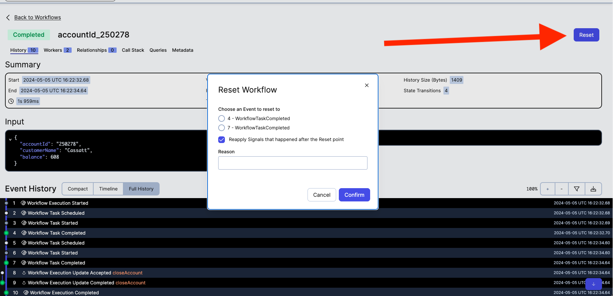
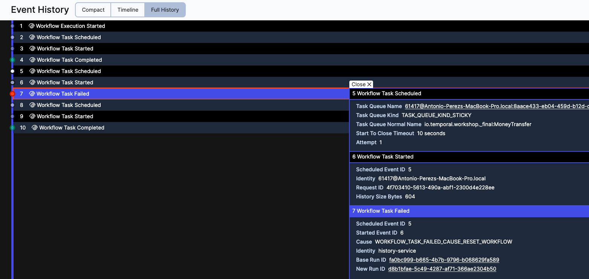
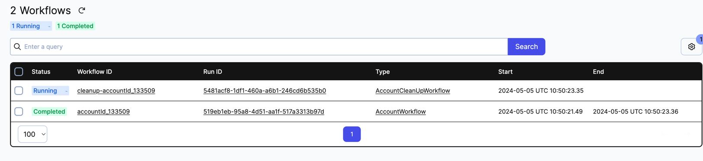

# Bank application

During this exercise, we are going to create an application to manage accounts and transfers using Temporal and Spring Boot.


## During development
We will need to restart the server several times during the course of this exercise, to start with a fresh environment after each change.
As we are making changes in your code, the code will become incompatible with the existing running workflows,
and we will run into non-deterministic errors (in this case because SDK is not able to recover the workflow state because the code is different). 
There are several techniques to make the code backward compatible, for now don't worry about this, but if you want to learn more 
about `Non Deterministic Errors` and versioning you can refer to this documentation later:
- [Deterministic constraints](https://docs.temporal.io/workflows#deterministic-constraints)
- [Intrinsic non-deterministic logic](https://docs.temporal.io/dev-guide/java/durable-execution#intrinsic-non-deterministic-logic)
- [Non-deterministic code changes](https://docs.temporal.io/dev-guide/java/durable-execution#durability-through-replays)
- [Versioning - Java SDK feature guide](https://docs.temporal.io/dev-guide/java/versioning)
- [Move Fast WITHOUT Breaking Anything - Workflow Versioning with Temporal](https://www.youtube.com/watch?v=kkP899WxgzY)
- [Workflow Versioning Strategies](https://community.temporal.io/t/workflow-versioning-strategies/6911)

### How to start with a fresh / clean environment
- If you run the server with `Temporal CLI`: restarting the server is enough (we are not persisting the data in the filesystem).
- If you run the server with `docker-compose`: run `docker-compose down -v`.

> This exercise utilizes the execution API (to start, signal, query workflow executions..) and the visibility API (to list workflow). 
Data in the visibility store is eventually consistent, so you might need to refresh the UI to see the latest data.

## Exercise

The application simulates a bank with the following features:

- Users can create accounts.
- Users can send money from one account to another account.
  - If the amount to transfer is > 100, the operation needs to be approved.
- Users can access account details, like transactions started from the account and the current amount.
- Users can close the account.
  - After the account is close, the system send a notification to the customer.


During this exercise, we are going to apply the concepts learned in the previous one, and:
- [Child workflows](https://docs.temporal.io/encyclopedia/child-workflows):
  A Child Workflow Execution is a Workflow Execution that is spawned from within another Workflow.
- [Custom Search Attributes](https://docs.temporal.io/visibility#custom-search-attributes):
  Search Attributes are searchable field, we can add SA that are relevant to our business needs to query workflow executions.

This folder contains two main sub-folders:
- `initial` is you starting point, the code skeleton within which you must work to complete the exercise following the steps described below..
- `solution` contains the final code, after all steps are implemented.

and 
- `springrunner` that contains REST Controllers and the SpringBootApplication class.
- We use thymeleaf for the view, you can find the views in `src/main/resources/templates`. 

You will notice that our UI has links
 `(View in Temporal UI)` to help relate what is shown in it with the Temporal UI.


Begin by working with the code in the `initial` folder. Take your time to familiarize yourself with the following pieces of code:

Temporal:
- [./AccountWorkflow.java](./AccountWorkflow.java): This is the interface of our main workflow. To highlight
  the following methods:
  - `open` is the main workflow method.
  - `requestTransfer` method to request transfer for one account to another account
  - `withdraw` to subtract money from the current account.
  - `deposit` to add money to the current account.

  Each instance of an `AccountWorkflow` represent an account in our system, it is what in Temporal is called Entity Workflow
(doc [here](https://temporal.io/blog/workflows-as-actors-is-it-really-possible) and [here](https://temporal.io/blog/actors-and-workflows-part-2)). 
Their main characteristics are:
  - they can run forever
  - they can spawn other workflows (Child workflows)
  - they can receive and react to messages (Signals and Updates)

- [./initial/ActivityWithTemporalClient.java](./initial/ActivityWithTemporalClient.java): Contains the activities to interact with workflow executions
to deposit and withdraw money. 
- [./initial/MoneyTransferWorkflowImpl.java](./initial/MoneyTransferWorkflowImpl.java): Is responsible from moving money from 
one account to another account, it is the same implementation we had in previous exercises. It uses `ActivityWithTemporalClient` to 
`withdraw` and `deposit` money to workflows (accounts).

Spring Boot: 
- [./springrunner/AccountViewController.java](./springrunner/AccountViewController.java) and 
[./springrunner/TransferViewController.java](./springrunner/TransferViewController.java) are REST Controllers that take 
the request and send it to the Temporal Server. From here we will start, query, signal workflows... 

###  Implementation


#### Users can create accounts.

- Open [./initial/AccountWorkflowImpl.java](initial/AccountWorkflowImpl.java) and add a basic implementation to the main method.

The main method is empty.
```
@Override
public void open(final Account account) {    
}

```

If we run the code now, the workflow will close immediately after starting (you can test it). We want the account Workflow to be long-running,
allowing interaction. 

Assign the value `account` passed to the `open` method to `this.account`, and block `Workflow.await` until `closeAccount` becomes true:
```
    @Override
    public void open(final Account account) {

        log.info("Account created " + account);
        this.account = account;
        Workflow.await(() -> closeAccount);
        
    }
```

Now the Workfow execution won't close, it will be running until the `Workflow.await` condition is true.

Note that `this.account` is used by `getAccountSummary` method to return the account info shown in our UI.

Let's create some accounts in our system.
- Restart the Temporal Server.
- [Run the code initial folder](./run-the-code-initial-folder.md). Don't forget to restart the [./initial/WorkerProcess.java](./initial/WorkerProcess.java).
  - Navigate to [http://localhost:3030/accounts](http://localhost:3030/accounts), the UI shows a list(empty) of 
accounts. 
  - Click `New Account`, it will show a form with dummy data (feel free to modify it), once the form is ready submit the information.
  - Now we have one account in our system


  - if you click `View in Temporal UI` it will take you to the Temporal UI showing the workflow in running state.

#### Users can send money from one account to another account.
During the previous exercises we have implemented [./initial/MoneyTransferWorkflowImpl.java](./initial/MoneyTransferWorkflowImpl.java), 
responsible from moving money from one account to another. Let's use it in our AccountWorkflow.

To do that, we have to implement the method [./initial/AccountWorkflowImpl.java](initial/AccountWorkflowImpl.java).`requestTransfer`.

- add the operation to `pendingTransferRequests`. We will process each request in the main workflow thread.
- wait until the operation starts, to get the workflowId or the moneyTransfer workflow.
- return workflowId.

The implementation will be as follows:

```
    @Override
    public RequestTransferResponse requestTransfer(final TransferRequest transferRequest) {

        //add the operation to `pendingTransferRequests`. We will process each request in the main workflow thread.
        this.pendingTransferRequests.add(transferRequest);

        //#1 wait until the operation starts, to get the workflowId or the moneyTransfer workflow
        Workflow.await(() -> startedRequest.get(transferRequest) != null);

        //Return workflowId
        final String operationId = startedRequest.get(transferRequest);
        return new RequestTransferResponse(operationId);

    }

```
Now, let's implement the main workflow method to process each request:

- We want to process requests while the workflow is open, and block until a new transfer request come to process it 
or the request to close the account arrives.

- If there is a pending request, process it starting the MoneyTransferWorkflow (as [ChildWorkflow](https://docs.temporal.io/dev-guide/java/features#child-workflows)) 
asynchronously. We start the ChildWorkflow asynchronously because we don't want to block the user request until the child workflow completes.

- After the workflow has started, remove the request from pending request and add the workflowId we want to return 
to the caller of `requestTransfer` method. This will unblock `Workflow.await` in `requestTransfer`.

- Finally, when ChildWorkflow completes add the result to the list or operations to track it. This list is 
returned as part of `getAccountSummary`

The implementation will be as follows:
```
    @Override
    public void open(final Account account) {

        log.info("Account created " + account);
        this.account = account;
        this.operations = new ArrayList<>();
    
    
        //while the workflow is open
        while (!closeAccount) {
    
    
            //Block until a new transfer request comes, or the request to close the account
            Workflow.await(() -> !pendingTransferRequests.isEmpty() || closeAccount);
    
    
            //If there is a pending request
            if (!pendingTransferRequests.isEmpty()) {
    
    
                //Process it starting the MoneyTransferWorkflow
                // (as [ChildWorkflow](https://docs.temporal.io/dev-guide/java/features#child-workflows)) asynchronously.
                final TransferRequest transferRequest = pendingTransferRequests.get(0);
    
                final String moneyTransferWorkflowId = "money-transfer-FROM_" + transferRequest.fromAccountId() +
                        "_TO_" + transferRequest.toAccountId()+"_AMOUNT_" + transferRequest.amount();
    
                log.info("Scheduling workflow " + moneyTransferWorkflowId);
    
                final MoneyTransferWorkflow moneyTransferWorkflow =
                        Workflow.newChildWorkflowStub(MoneyTransferWorkflow.class,
                                ChildWorkflowOptions.newBuilder()
                                        .setWorkflowId(
                                                moneyTransferWorkflowId)
                                        .build());
    
                // We start the ChildWorkflow asynchronously, we don't want to block the user request until the child workflow completes.
                // https://community.temporal.io/t/best-way-to-create-an-async-child-workflow/114/2
                final Promise<TransferResponse> request = Async.function(moneyTransferWorkflow::transfer, transferRequest);
                WorkflowExecution execution = Workflow.getWorkflowExecution(moneyTransferWorkflow).get();
    
    
                // Remove the request from pendingTransfer after the workflow start
                pendingTransferRequests.remove(transferRequest);
    
                // Unblock #1
                // This is the workflowId we return to the client as response to `requestTransfer`
                startedRequest.put(transferRequest, execution.getWorkflowId());
    
                request.thenApply((response)->{
    
                    // wait until the ChildWorkflow completes and add the result to the list or operations to track it.
                    //This list is returned as part of `getAccountSummary`
                    final TransferResponse transferResponse = request.get();
                    this.operations.add(new Operation(execution.getWorkflowId(), transferResponse));
    
                   return response;
               });
    
    
            }
        }

```


Let's test the new implementation:
- Restart the Temporal Server.
- [Run the code initial folder](./run-the-code-initial-folder.md). Don't forget to restart the [./initial/WorkerProcess.java](./initial/WorkerProcess.java).
  - Navigate to [http://localhost:3030/accounts](http://localhost:3030/accounts) and create two accounts.
  - Click `Request transfer` for one of the accounts, it will show a form with dummy data (don't change the amount for now), submit the information.


Take some time to understand what has happened, there is a lot going on:
- Click `View in Temporal UI` for the source account, the one that started the `Request transfer`.
 

  - `requestTransfer` is the operation we have initiated from the UI
  - `MoneyTransferWorkflow` is the ChildWorkflow, started from our java code.
  - `withdraw` is the method, in [./initial/AccountWorkflowImpl.java](initial/AccountWorkflowImpl.java), 
the activity implementation [./initial/ActivityWithTemporalClient.java](./initial/ActivityWithTemporalClient.java) 
(used by [./initial/MoneyTransferWorkflowImpl.java](./initial/MoneyTransferWorkflowImpl.java)) calls to take money from the account. 
  - The [./initial/AccountWorkflowImpl.java](initial/AccountWorkflowImpl.java).`deposit` method is invoked 
by [./initial/ActivityWithTemporalClient.java](./initial/ActivityWithTemporalClient.java) to add money to the account. 
Open the target workflow and verify it.

  

- Inspect the `Full history` of the source account too.

  

  - Note how the ChildWorkflow completes (event 20) after the method `requestTransfer` returns (event 14).

- Click `relationships`, it will show the ChildWorkflow started from our account workflow.

  
 
  - We can access the same information in our application if we click `Show details`

  

  

  [./initial/AccountWorkflowImpl.java](initial/AccountWorkflowImpl.java).`getAccountSummary` contains the list of operations showed in this view.


- **If the amount to transfer is > 100, the operation needs to be approved**.

We already have the logic in our [./initial/MoneyTransferWorkflowImpl.java](./initial/MoneyTransferWorkflowImpl.java) workflow
to wait for approval if the amount > 100, but we don't have a way to list workflows on this state.

The script (and the instructions) to start the server contains a command to create a Custom Search Attribute
in the namespace.
`temporal operator search-attribute create --namespace "default" --name TransferRequestStatus --type Keyword`

Now we can add this Search Attribute to workflows awaiting approval. No we can run queries like 
`WorkflowType="MoneyTransferWorkflow" and ExecutionStatus="Running" and TransferRequestStatus="ApprovalRequired"`
from the [Temporal UI](http://localhost:8080/namespaces/default/workflows?query=WorkflowType%3D%22MoneyTransferWorkflow%22+and+ExecutionStatus%3D%22Running%22+and+TransferRequestStatus%3D%22ApprovalRequired%22)
or the SDK (see `TemporalService.getPendingRequests` implementation)

- Modify the [./initial/MoneyTransferWorkflowImpl.java](./initial/MoneyTransferWorkflowImpl.java) to make the workflow
searchable if amount > 100. Add the following code to the main method, within the `if (transferRequest.amount() > 100)` block.

```
//Setting this SA will allow query workflows by `TransferRequestStatus="ApprovalRequired"`
//http://localhost:8080/namespaces/default/workflows?query=WorkflowType%3D%22MoneyTransferWorkflow%22+and+ExecutionStatus%3D%22Running%22+and+TransferRequestStatus%3D%22ApprovalRequired%22
Workflow.upsertTypedSearchAttributes(
        TransferRequestStatus.valueSet(transferStatus.name())
);

```

Let's test the new it:
- Restart the Temporal Server.
- [Run the code initial folder](./run-the-code-initial-folder.md). Don't forget to restart the [./initial/WorkerProcess.java](./initial/WorkerProcess.java).
  - Navigate to [http://localhost:3030/accounts](http://localhost:3030/accounts) and create two accounts.
  - Click `Request transfer` for one of the accounts, it will show a form with dummy data, **change amount to a value > 100** and submit the information.
  - Our UI will show a pending operation, click and Approve/Deny the operation.

  

  - Note that there is a timer in the MoneyTransferWorkflow workflow that will fire if the operation is not Approved/Denied within 30 seconds, 
and the operation will be marked as `TimedOut`. Create one request and let it times out.

As we did before, take your time to understand what is going on by looking into the workflow histories using the Temporal UI.

> There are several ways to implement this functionality, Custom SA is used to introduce the concept.

#### Users can access account details, like transactions started from the account and the current amount.

This is already implemented. Ilustrate how we can use QueryMethod to retrieve workflow internal state. 
When we click `Show details` for one of the accounts, our Spring App invokes [./initial/AccountWorkflowImpl.java](initial/AccountWorkflowImpl.java).`getAccountSummary`.


#### Users can close the account.

Now that users can open accounts and transfer money, let's give them the possibility to close the account too.

- Implement the method [./initial/AccountWorkflowImpl.java](initial/AccountWorkflowImpl.java).`closeAccount` to set `closeAccount` variable to `true`.
This will make `while (!closeAccount) {` exits. 

To test this: 
- Restart the Temporal Server.
- [Run the code initial folder](./run-the-code-initial-folder.md). Don't forget to restart the [./initial/WorkerProcess.java](./initial/WorkerProcess.java).
  - Navigate to [http://localhost:3030/accounts](http://localhost:3030/accounts) and create one account.
  - Click `Close account`.
  - This will end the while loop in the main workflow method and the workflow will complete.
  - Go to the temporal UI and verify it.

  

- Now [reset](https://docs.temporal.io/workflows#reset) the workflow you just closed. Go to the UI and it, 

  
  
  it will create a new workflow execution that continues from the reset point 

  

  and has a link to the previous one.

  


- **After the account is close, the system send a notification to the customer.**

ChildWorkflows has their own life cycle, they can continue running after the parent closes. When starting 
a child workflow we can indicate the [Parent Close Policy](https://docs.temporal.io/encyclopedia/child-workflows#parent-close-policy), 
to determine what will happen to a Child Workflow Execution if its Parent changes to a Closed.


The workflow `AccountCleanUpWorkflowImpl` send a notification to the customer regarding their closed account. We can 
start this workflow in ABANDON mode before closing the account. The child workflow will continue running and complete on 
their own pace.

Take your time to familiarize yourself with the [./initial/AccountCleanUpWorkflowImpl.java](./initial/AccountCleanUpWorkflowImpl.java) implementation.

- Similar to the previous implementation where we started the MoneyTransferWorkflow, add the logic to
the main workflow method to start this `AccountCleanUpWorkflowImpl` workflow, but this time in ABANDON mode.
After the while loop:

```

    // Closing account
    // Start AccountCleanUpWorkflow that will be responsible for sending a notification to the customer,
    final AccountCleanUpWorkflow accountCleanUpWorkflow = Workflow.newChildWorkflowStub(AccountCleanUpWorkflow.class,
            ChildWorkflowOptions
                    .newBuilder()
                    .setWorkflowId(AccountCleanUpWorkflow.workflowIdFromAccountId(account.accountId()))
                    // AccountCleanUpWorkflow will continue running due to PARENT_CLOSE_POLICY_ABANDON
                    // More info PARENT_CLOSE_POLICY https://docs.temporal.io/workflows#parent-close-policy
                    .setParentClosePolicy(ParentClosePolicy.PARENT_CLOSE_POLICY_ABANDON)
                    .build());


    Async.procedure(accountCleanUpWorkflow::run, this.account);
    Workflow.getWorkflowExecution(accountCleanUpWorkflow).get();

    // By exiting here we are closing the current workflow execution

```


To test this:
- Restart the Temporal Server.
- [Run the code initial folder](./run-the-code-initial-folder.md). Don't forget to restart the [./initial/WorkerProcess.java](./initial/WorkerProcess.java).
  - Navigate to [http://localhost:3030/accounts](http://localhost:3030/accounts) and create one account.
  - Click `Close account` for one of the accounts.
  - Navigate to the [Temporal UI](http://localhost:8080) and note the child workflow is still running, it will close after 
  30 seconds (according the sleep we added to the implementation)





###  Add more features to this app

There is much more you can do with Temporal, here some ideas on how you can continue playing with this example:

- **What if you want to cancel a pending request?** You can run the ChildWorkflow (MoneyTransferWorkflow) within a
  [CancellationScope](https://github.com/temporalio/samples-java/blob/01b6ba14b7e98378e9de960a89958fcdd8973ce3/core/src/main/java/io/temporal/samples/hello/HelloCancellationScope.java#L145)
  and have a Signal/Update method in the main workflow to allow cancel the operation.

- **Use data converters to encrypt the payload**
  - [Documentation](https://docs.temporal.io/dataconversion#custom-data-converter)
  - [Example](https://github.com/temporalio/samples-java/tree/main/core/src/main/java/io/temporal/samples/encryptedpayloads)

- **Continue-As-New before the workflow history reaches the event history limit.**
  - [What is Continue-As-New?](https://docs.temporal.io/workflows#continue-as-new)
  - [How to Continue-As-New](https://docs.temporal.io/dev-guide/java/features#continue-as-new)
  - `if Workflow.getInfo().isContinueAsNewSuggested() then CAN` or 
  `if Workflow.getInfo().getHistoryLength() > number of events then CAN`


---


### Run the code (solution)

You can run this code to play with the final implementation:

- Ensure you have everything you need to run the code, and the Temporal Server is running.
  See [prepare-your-environment.md](./../../../../../../../../prepare-your-environment.md).

- Stop any processes that are running as part of other exercises (such as workers), except the Temporal Server.

- Start the Worker process

```bash
# Go to the root directory
cd ./../../../../../../../
# from the root directory execute
 ./mvnw compile exec:java -Dexec.mainClass="io.temporal.workshop._final.solution.WorkerProcess"

```

- Start the Spring Boot application

```bash
# Go to the root directory
cd ./../../../../../../../
# from the root directory execute
 ./mvnw compile exec:java -Dexec.mainClass="io.temporal.workshop._final.springrunner.Application"

```

Navigate to  [http://localhost:3030/](http://localhost:3030/), where our application exposes the UI.
